# Enhanced Goodies and Hostile Villagers (EGHV) for Civilization VI
A mod which enables additional Frontend and Ingame settings related to Tribal Village (Goody Hut) rewards.

# Overview
EGHV performs a fairly comprehensive overhaul of and extension to the Goody Hut reward system. Many new Frontend options relating to Goody Huts are available within the game's single-player Advanced Setup and multi-player Host Game, including:
- A custom picker for selecting exactly which rewards, if any, will have a chance of being provided by a Goody Hut ingame. As with the built-in pickers for City-States and Natural Wonders, undesired rewards can be excluded.
- A new slider control for decreasing or increasing the amount of Goody Huts that will be placed ingame, relative to the baseline amount for the selected map and size. This control is also present within the Goody Hut picker.
- New options that control the total amount of rewards provided by a Goody Hut, the amount of new units or citizens certain rewards will provide, whether the new buildings provided by certain rewards are available to be constructed at game start, the relative chances of receiving all active rewards, whether a single Goody Hut can provide the same reward more than once, and more.

The total amount of available Goody Hut rewards has greatly increased for each official ruleset.

Ingame, the built-in system for choosing and applying rewards has been replaced by a custom Lua Reward Generator. Each activated Goody Hut -- or in the case of Sumeria, dispersed Barbarian Outpost -- will prompt Reward Generator to select one or more applicable rewards from the pool of active rewards; if a selected reward is invalid for any reason, Reward Generator will try again until it finds one that is valid. This resolves several problems with the built-in system.

Minimum turn requirements have been removed from all rewards. Instead, many existing and new rewards now have a minimum Civic and/or Technology prerequisite which must be met. Some rewards can only be granted once per player per game Era.

Rewards themselves are implemented via a combination of the built-in Modifiers system and the Lua scripting system, which allows all rewards to function as intended.

Every reward generates popup World View text indicating what was provided. In addition, each activated Goody Hut will generate a notification with a summary of all rewards provided by that Goody Hut. Some rewards may generate additional notifications. Popup text and notifications are only provided for human players.

Finally, Hostile Villagers as (and now, potentially following) a reward make their return.

Some limitations apply; see below for these and more comprehensive details.

# Translations
New Frontend and Ingame text is fully localized in the following languages:
- English (en_US)
- Spanish (es_ES)
- French (fr_FR)

Please report any conspicuous absent text, grammatical errors, inaccurate translations, or instances of localization placeholders (i.e. LOC_SOME_TEXT_HERE), when using any of the above languages.

# Dependencies
EGHV **REQUIRES** Enhanced Community FrontEnd, and will be blocked from loading if that mod is not present or is not enabled.

# Features
EGHV alters Frontend and Ingame components relating to the selection and application of Goody Hut rewards. These changes are described below.

## Reward Generator
EGHV uses its own custom database tables to determine reward selections. The Weights for all rewards present in the relevant existing database tables have been set to zero, and a single dummy reward has been introduced, which basically becomes the only reward that the built-in reward selection system will grant whenever a Goody Hut Reward event occurs. This allows the built-in system to be effectively replaced by a custom Lua script known as Reward Generator.

For each reward to be granted, Reward Generator will make up to ***n*** attempts to randomly select a valid reward from the active pool, where ***n*** is equal to the total number of rewards in the active pool. After ***n*** attempts, if a valid reward has not been selected, Reward Generator will resort to a Fallback reward as detailed below. This prevents hangs and CTD in situations where Reward Generator would indefinitely fail to identify a valid reward, such as when:
- The active pool contains only rewards that require a valid unit but the Goody Hut was discovered via border expansion or by one or more units that are not eligible targets of any of the available rewards.
- The active pool contains only rewards that have possession of at least one City as a requirement but the player has none.
- The active pool contains only rewards with Civic and/or Technology prerequisites which the player has not met.
- The active pool contains only rewards that can only be granted once per game Era and the player has previously received those rewards the maximum number of times that the current game Era allows.
- Every reward in the active pool has already been granted by the Goody Hut and the "No Duplicate Rewards" option is enabled.

## Fallback Rewards
Many Common rewards detailed below are designated as Fallback rewards within EGHV's custom database tables. These rewards do not require a unit or player possession of a City, do not produce hostile units, and have no Civic or Technology prerequisites or other restrictions of any kind. These rewards are therefore valid regardless of how a Goody Hut was activated. These rewards will always be available in the Fallback pool, even when they have otherwise been excluded from normal consideration.

When Reward Generator fails to select a valid reward as detailed above, it will then make up to ***f*** attempts to select a reward from the Fallback pool, where ***f*** is equal to the total number of rewards in the Fallback pool.

Bad luck with the RNG means that, however unlikely, it is still possible that Reward Generator will exhaust its allotted attempts and fail to select a valid reward from both the active and Fallback pools. If this happens, Reward Generator will simply abort with no discernable affect.

## Supported Goody Hut Rewards
EGHV modifies existing Goody Hut rewards, and provides several new rewards, in both existing and new categories. All categories are equally weighted by default; table column headers below generally reflect each individual reward's rarity tier and likelihood of being the selected reward if its category is selected.

Minimum turn requirements have been removed from all rewards. Instead, many existing and new rewards now have a minimum Civic and/or Technology prerequisite which must be met. Some rewards can only be granted once per player per game Era. Additionally, minimum City and unit requirements are enforced for applicable rewards.

The total amount of available Goody Hut rewards has nearly quadrupled:

Ruleset in use | Standard | Rise and Fall | Gathering Storm
:--- | :---: | :---: | :---:
Rewards (Types) built-in | 18 (6) | 18 (6) | 23 (8)
Rewards (Types) with EGHV | 69 (15) | 73 (16) | 82 (18)

Following is a list of all recognized rewards arranged (1) alphabetically by category and (2) by ascending rarity, with the number of rewards in each category and the minimum ruleset for which they are valid.

### Abilities: Standard (4 rewards)
This new category contains new rewards provided by EGHV which grant abilities to valid target units. These rewards will only be selected by Reward Generator when a Goody Hut has been discovered by one or more units.

Common (55%) | Uncommon (30%) | Rare (10%) | Legendary (5%)
:---: | :---: | :---: | :---:
 |  |  | 
+1 Sight | +20 Healing/turn | +1 Movement | +10 Strength

- These rewards apply to all valid units in formation with the unit that discovers the Goody Hut, and can be granted to any given unit up to one time for the lifetime of that unit.
- Improved Sight and Improved Movement are valid for all units.
- Improved Healing and Improved Combat Strength are valid only for combat units. When received by a non-combat unit, Improved Sight or Improved Movement will be randomly selected instead.
- When all target units are ineligible for the selected ability, or any applicable replacement, the reward will fail, and Reward Generator will resort to a Fallback reward.

### Civics: Standard (4 rewards)
This new category contains existing and new rewards which grant random Civics (boosts) when received. Existing rewards were previously in the built-in Culture category. The Legendary reward is provided by EGHV. These rewards can be selected by Reward Generator regardless of how a Goody Hut was discovered.

Common (55%) | Uncommon (30%) | Rare (10%) | Legendary (5%)
:---: | :---: | :---: | :---:
 |  |  | 
1 Civic boost | 2 Civic boosts | 1 Civic | 2 Civics

- The Common reward is a designated Fallback reward.
- When the Rare reward is received prior to researching Code of Laws, Code of Laws will always be the free Civic granted.
- Due to a bug where only one Civic would be granted prior to researching Code of Laws, with that Civic being Code of Laws, the Legendary reward will not be selected by Reward Generator when Code of Laws has not yet been researched.

### Culture: Standard (4 rewards)
This existing category contains new rewards provided by EGHV which provide one-time Culture yields. Other rewards which were previously in this category have been moved to the new Civics category and the existing Faith category. These rewards can be selected by Reward Generator regardless of how a Goody Hut was discovered.

Common (55%) | Uncommon (30%) | Rare (10%) | Legendary (5%)
:---: | :---: | :---: | :---:
 |  | 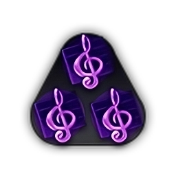 | 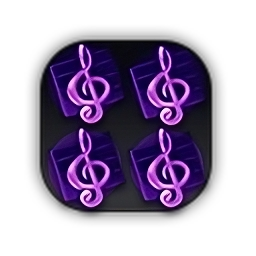
+5 Culture | +10 Culture | +15 Culture | +25 Culture

- The Common reward is a designated Fallback reward.

### Diplomacy: Gathering Storm (4 rewards)
This existing category contains new rewards provided by EGHV which provide one-time Diplomatic Favor yields. Existing rewards in this category have been superceded. These rewards require Gathering Storm or a later ruleset, and will not be available when an earlier ruleset is in use. These rewards can be selected by Reward Generator regardless of how a Goody Hut was discovered.

Common (55%) | Uncommon (30%) | Rare (10%) | Legendary (5%)
:---: | :---: | :---: | :---:
 |  | 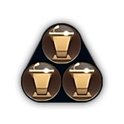 | 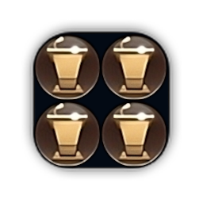
+10 Favor | +20 Favor | +30 Favor | +50 Favor

- The Common reward is a designated Fallback reward.

### Envoys: Standard (4 rewards)
This new category contains new rewards provided by EGHV which provide one or more free Envoys. These rewards can be selected by Reward Generator regardless of how a Goody Hut was discovered.

Common (55%) | Uncommon (30%) | Rare (10%) | Legendary (5%)
:---: | :---: | :---: | :---:
 |  | 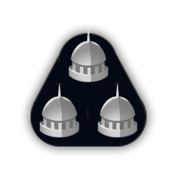 | 
1 Envoy | 2 Envoys | 3 Envoys | 4 Envoys

- The Common reward is a designated Fallback reward.
- When the Gathering Storm expansion is present and in use, the Common reward will supercede that expansion's "one free Envoy" reward, which has been removed from the Diplomacy category.

### Faith: Standard (4 rewards)
This existing category contains existing rewards which provide one-time Faith yields. It also contains the existing "one free relic" reward which was previously in the existing Culture category. These rewards can be selected by Reward Generator regardless of how a Goody Hut was discovered.

Common (55%) | Uncommon (30%) | Rare (10%) | Legendary (5%)
:---: | :---: | :---: | :---:
 | 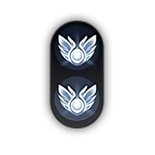 | 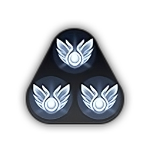 | 
+20 Faith | +60 Faith | +100 Faith | +1 Relic

- The Common reward is a designated Fallback reward.
- The Legendary reward will not be selected by Reward Generator if the player does not possess at least one City.

### Gold: Standard (4 rewards)
This existing category contains existing rewards which provide one-time Gold yields. It also contains a new reward that grants one additional trade route capacity; this reward is provided by EGHV. These rewards can be selected by Reward Generator regardless of how a Goody Hut was discovered.

Common (55%) | Uncommon (30%) | Rare (10%) | Legendary (5%)
:---: | :---: | :---: | :---:
 |  | 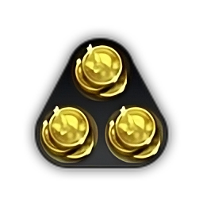 | 
+40 Gold | +80 Gold | +120 Gold | +1 Trade Route

- The Common reward is a designated Fallback reward.
- The Legendary reward will not be selected by Reward Generator if the player does not possess at least one City.

### Goody Huts: Standard (4 rewards)
This new category contains new rewards provided by EGHV which will place one or more new Goody Huts on the map. Each new Goody Hut will be created in a random valid plot which is at least 3 plots and no more than 8 plots away from the target plot. These rewards can be selected by Reward Generator regardless of how a Goody Hut was discovered.

Common (55%) | Uncommon (30%) | Rare (10%) | Legendary (5%)
:---: | :---: | :---: | :---:
 |  |  | 
1 new Goody Hut | 2 new Goody Huts | 3 new Goody Huts | 4 new Goody Huts

- The Common reward is a designated Fallback reward.

### Governors: Rise and Fall (4 rewards)
This new category contains new rewards provided by EGHV which provide one or more free Governor titles. These rewards require Rise and Fall or a later ruleset, and will not be available when an earlier ruleset is in use. These rewards can be selected by Reward Generator regardless of how a Goody Hut was discovered.

Common (55%) | Uncommon (30%) | Rare (10%) | Legendary (5%)
:---: | :---: | :---: | :---:
 | 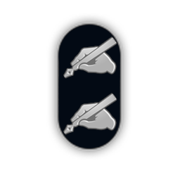 | 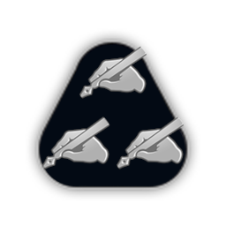 | 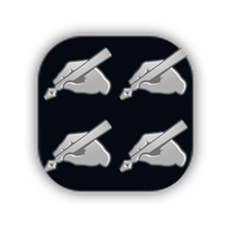
1 Governor Title | 2 Governor Titles | 3 Governor Titles | 4 Governor Titles

- All rewards in this category have one City as a prerequisite; they will not be selected by Reward Generator if the player does not possess at least one City.
- When the Gathering Storm expansion is present and in use, the Common reward will supercede that expansion's "one free Governor Title" reward, which has been removed from the Diplomacy category.

### Hostile Villagers: Standard (4 rewards)
This new category contains new rewards provided by EGHV which produce one or more Barbarian units, and possibly a Barbarian Outpost. Each hostile unit or outpost will be placed in a random valid plot within 3 plots of the target plot. These rewards can be selected by Reward Generator regardless of how a Goody Hut was discovered.

Common (55%) | Uncommon (30%) | Rare (10%) | Legendary (5%)
:---: | :---: | :---: | :---:
 |  | 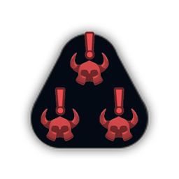 | 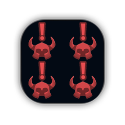
1 hostile unit | 2 hostile units | 3 hostile units | 4 hostile units AND 1 camp

- Each produced unit will be randomly selected. Melee, Ranged, and Anti-Cavalry units are always potential choices when there are any valid land plots near the target plot; when there is at least one source of Horses near the target plot, Heavy Cavalry and Light Cavalry units are additional potential choices. Naval Melee and Naval Ranged units are always potential choices when there are any valid water plots near the target plot. Naval units will be favored when there are more valid water plots near the target plot than there are valid land plots; otherwise, land units will be favored.
- Each unit produced will be the most advanced of its class that Barbarian research and nearby resources allow. For example, if it is the Classical Era and a Melee unit is produced, and Iron Working has been researched by the Barbarian player, this unit will be a Swordsman ***IF*** there is also a source of Iron near the target plot; otherwise, it will be a Warrior.

### Military: Standard (9 rewards)
This existing category contains existing and new rewards which provide one or more military units. Except for the "one free recon unit" reward, all rewards are provided by EGHV. Each new unit will be created in a random valid plot immediately adjacent to the target plot. If this fails, or if there are no valid nearby plots, a random City belonging to the player will be selected, and the unit will instead be created in that City's Encampment district if one is present, or in its City Center district otherwise. These rewards can be selected by Reward Generator regardless of how a Goody Hut was discovered.

Common (55%) | Uncommon (30%) | Rare (10%) | Legendary (5%)
:---: | :---: | :---: | :---:
 |  |  | 
1 Recon unit | 1 Melee unit OR 1 Ranged unit OR 1 Anti-Cavalry unit | 1 Heavy Cavalry unit OR 1 Light Cavalry unit | 1 Support unit OR 1 Siege unit OR 1 Military Engineer

Some of these rewards will not be selected by Reward Generator if specific Technology prerequisites are not met:

Unit class or type | Technology prerequisite
:--- | :---:
Anti-Cavalry | Bronze Working
Heavy Cavalry | The Wheel
Light Cavalry | Horseback Riding
Support | Masonry
Siege | Engineering
Military Engineer | Military Engineering

- The Common reward is a designated Fallback reward.
- Horses are an additional requirement for Light Cavalry units beyond the technology requirement. When the player does not possess at least one source of Horses, a Light Cavalry unit will be converted into a Heavy Cavalry unit if the player has met that class's technology prerequisite as detailed above, or into a Ranged unit otherwise.
- Excluding the Military Engineer, each unit produced will be the most advanced of its class that player research and resources allow. For example, if it is the Classical Era and a Melee unit is produced, and Iron Working has been researched by the player, this unit will be a Swordsman ***IF*** the player also possesses at least one source of Iron; otherwise, it will be a Warrior.

### Policies: Standard (4 rewards)
This new category contains new rewards provided by EGHV which grant additional government policy slots beyond those the player's chosen government normally provides. All rewards are of Mythic rarity and have inherently equalized Weights. Each reward's likelihood of being selected is ***(1 / X)%***, where ***X*** is equal to the number of available rewards in this category which are presently active. These rewards can be selected by Reward Generator regardless of how a Goody Hut was discovered.

Military | Economic | Diplomatic | Wildcard
:---: | :---: | :---: | :---:
 |  | 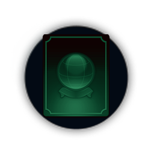 | 
1 Military policy slot | 1 Economic policy slot | 1 Diplomatic policy slot | 1 Wildcard policy slot

To ensure that a suitable pool of policies is available to select from, these rewards will not be selected by Reward Generator if specific Civic prerequisites are not met:

Policy type | Civic prerequisite
:--- | :---:
Military | Political Philosophy
Economic | Political Philosophy
Diplomatic | Diplomatic Service
Wildcard | Political Philosophy

- These rewards are potentially game-breaking, and not just in the sense that they provide powerful benefits. They may only be granted once per player per game Era.

### Promotions: Standard (5 rewards)
This new category contains new rewards provided by EGHV which grant combat experience or a free upgrade and respec to valid target units. These rewards will only be selected by Reward Generator when a Goody Hut has been discovered by one or more units.

Common (55%) | Uncommon (30%) | Rare (10%) | Legendary (5%)
:---: | :---: | :---: | :---:
 | 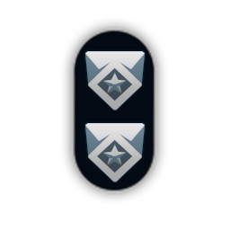 |  | 
+25% XP to next level | +50% XP to next level | +75% XP to next level | 100% XP to next level OR "Upgrade" unit

- Experience rewards apply to all valid units in formation with the unit that discovers the Goody Hut, and can be granted to any given unit an unlimited number of times if the unit is eligible for combat experience. The amount of experience granted will be a percentage of the total experience needed for the unit to attain its next promotion.  However, built-in limitations prevent a given unit from earning more experience than is needed for its next promotion, so any experience earned beyond this amount by any unit will be lost.
- For each valid unit, the Upgrade unit reward will provide a free "upgrade" if this unit has a valid upgrade path. The player's research and resources must be able to support a manual upgrade of this unit, but there will be no associated Gold cost. Due to built-in limitations, this "upgrade" will consist of the following:
  1. The existing unit will be destroyed.
  2. A new unit of the type the existing unit would have upgraded to will be placed in the last plot the existing unit is known to have occupied.
  3. The new unit will retain any abilities attached to the existing unit, as well as any veteran name assigned to it.
  4. The new unit will receive 100% of the combat experience needed for its first promotion; any promotions the existing unit had earned will be stored, and can be immediately reselected by the new unit after choosing its first promotion.
  5. The new unit's movement will be reset to zero for the current turn.
- When all target units are ineligible for combat experience, or do not have a valid upgrade path, these rewards will fail, and Reward Generator will resort to a Fallback reward.

### Resources: Gathering Storm (4 rewards)
This existing category contains new rewards provided by EGHV which provide one-time strategic resource caches. These rewards require Gathering Storm or a later ruleset, and will not be available when an earlier ruleset is in use. These rewards can be selected by Reward Generator regardless of how a Goody Hut was discovered.

Common (55%) | Uncommon (30%) | Rare (10%) | Legendary (5%)
:---: | :---: | :---: | :---:
 |  | 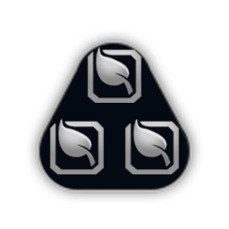 | 
+10 Resources | +20 Resources | +30 Resources | +50 Resources

- The Common reward is a designated Fallback reward.
- These rewards supercede the "free strategic resources" reward, which has been removed.
- The cache of resources provided will be of the most advanced type the player has revealed.
- These rewards will not be selected by Reward Generator if the player has not yet researched either Animal Husbandry (revealing Horses) or Bronze Working (revealing Iron). This fixes a bug which causes these rewards to have no effect when no types of strategic resources have been revealed.

### Science: Standard (4 rewards)
This existing category contains new rewards provided by EGHV which provide one-time Science yields. Other rewards which were previously in this category have been moved to the new Techs category. These rewards can be selected by Reward Generator regardless of how a Goody Hut was discovered.

Common (55%) | Uncommon (30%) | Rare (10%) | Legendary (5%)
:---: | :---: | :---: | :---:
 | 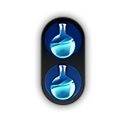 | 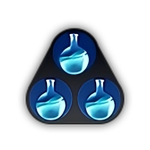 | 
+5 Science | +10 Science | +15 Science | +25 Science

- The Common reward is a designated Fallback reward.

### Secrets: Standard (7 rewards) or Gathering Storm (8 rewards)
This new category contains new rewards provided by EGHV which unlock or provide the various Villager Totem buildings. All rewards are of Mythic rarity and have inherently equalized Weights. Each reward's likelihood of being selected is ***(1 / X)%***, where ***X*** is equal to the number of available rewards in this category which are presently active. These rewards can be selected by Reward Generator regardless of how a Goody Hut was discovered.

Amenities | Culture | Faith | Food | Gold | Production | Science | Favor
:---: | :---: | :---: | :---: | :---: | :---: | :---: | :---:
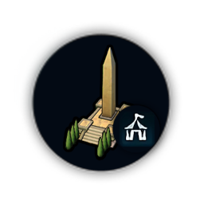 | 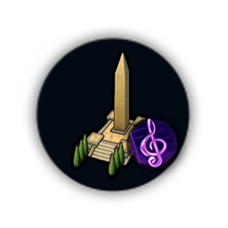 | 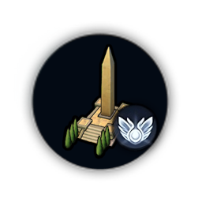 | 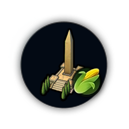 | 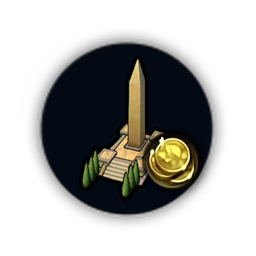 | 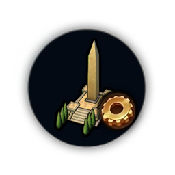 | 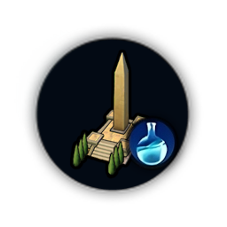 | 
+4 Amenities | +4 Culture | +4 Faith | +4 Food | +8 Gold | +4 Production | +4 Science | +4 Favor [1]

1. Requires Gathering Storm.

- Once a particular Totem has been unlocked, if the reward that provides it is received again, a random City belonging to the player that has not already built the Totem will be selected instead, and a free Totem of that type will be placed in that City. If all of the player's Cities have that Totem already, or if there are otherwise no cities in which to place it, the reward will fail, and Reward Generator will resort to a Fallback reward.

### Survivors: Standard (4 rewards)
This existing category contains existing rewards which provide one or more civilian units or additional population in Cities. These rewards can be selected by Reward Generator regardless of how a Goody Hut was discovered.

Common (55%) | Uncommon (30%) | Rare (10%) | Legendary (5%)
:---: | :---: | :---: | :---:
 |  |  | 
+1 Population | 1 Builder | 1 Trader | 1 Settler

- All rewards in this category except for the Legendary reward have one City as a prerequisite; they will not be selected by Reward Generator if the player does not possess at least one City.
- Due to a bug, the built-in reward system would irrepairably break for any player that received the "add population" reward more than once from a single Goody Hut. This reward is now provided by Lua directly, which has the additional benefit of enabling more than one free citizen to be granted per City.
- Any Builder or Settler provided by the appropriate rewards will now be created in a plot immediately adjacent to the target plot. If this fails, or if there are no valid nearby plots, the unit will instead be created in the City Center district of a randomly selected City belonging to the player.
- Any Trader provided by the appropriate reward will always be created in the City Center district of a randomly selected City belonging to the player.

### Techs: Standard (4 rewards)
This new category contains existing and new rewards which grant random Technologies (boosts) when received. Existing rewards were previously in the built-in Science category. The Legendary reward is provided by EGHV. These rewards can be selected by Reward Generator regardless of how a Goody Hut was discovered.

Common (55%) | Uncommon (30%) | Rare (10%) | Legendary (5%)
:---: | :---: | :---: | :---:
 | 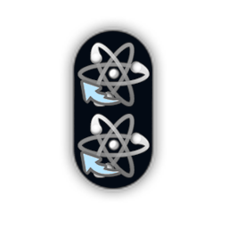 |  | 
1 Tech boost | 2 Tech boosts | 1 Tech | 2 Techs

- The Common reward is a designated Fallback reward.

## Goody Hut Reward Picker

EGHV provides a custom picker for selecting the specific rewards that can be provided by a Goody Hut ingame, available in the game's single-player Advanced Setup and multi-player Host Game. Content presented in the picker will vary with the selected ruleset and/or compatible community content, and can be sorted by:
- Name (alphabetical by individual reward subtype)
- Type (alphabetical by individual reward subtype, then grouped by parent reward type)
- Rarity (alphabetical by individual reward subtype, then ascending by rarity tier)

Disabling all available rewards via the picker will explicitly enable the "No Goody Huts" game option.

## New Game Setup Options

EGHV provides many new options which can control the behavior of Reward Generator and selected rewards ingame.

### Goody Hut Distribution Slider
EGHV provides a slider for decreasing or increasing the relative amount of Goody Huts that will appear on the selected map; this slider defaults to 100%, and adjusts in increments of 25% in a range of 25% - 500%, inclusive. This slider also appears in the picker window.

### No Duplicate Rewards
EGHV provides an option which, when enabled, will prevent a single Goody Hut from providing the same reward more than once. Disabling this can result in silliness like an unlucky RNG giving you five free recon unit rewards from a single Goody Hut, although it can also reduce the number of attempts Reward Generator must make. The default setting is enabled.

### Equalized Reward Chances
EGHV provides an option which, when enabled, assigns every enabled reward in a category a Weight equal to that category's Weight. This results in most enabled rewards having a roughly equal chance of being selected. The default setting is disabled.

### Disable Meteor Strike Goodies (Gathering Storm)
EGHV provides an option which, when enabled, will prevent any reward from being provided by the meteor strike event. Requires Gathering Storm or a later ruleset. The default setting is disabled.

### Rewards Per Tribal Village
EGHV provides a dropdown for selecting the total number of potential rewards each Goody Hut may provide. As detailed above, Reward Generator will attempt to select at least one and up to ***r*** total rewards to grant from each Goody Hut, where ***r*** is equal to the value of this option.

Sometimes, fewer than ***r*** rewards will be received. This can happen when:
- Reward Generator fails to select a valid reward from both the active and Fallback pools.
- Hostile Villagers are selected as a reward, whether it's the first reward or a bonus reward. When this happens, it will be the last reward granted by this Goody Hut; if it is the first reward, it will be the only reward.

Any number of rewards beyond one can only be received from a Goody Hut. There are two main consequences of this:
1. Bonus rewards will not be provided when Civilization traits or other abilities provide a reward when another condition is met, such as when Sumeria disperses a Barbarian Outpost. Nice try, Gilgamesh.
2. When using the Gathering Storm ruleset, the meteor strike reward will not provide any bonus rewards. For now, we're going to assume that the meteor is not the wreckage of advanced replicator technology from beyond the stars.

### New Units/Citizens
EGHV provides a dropdown for selecting the likelihood of a free unit or population reward providing two units or citizens instead of only one.

### Unlock Villager Secrets
EGHV provides a dropdown which controls whether the Villager Totem buildings must first be unlocked before they can be built.

### Hostiles After Reward
EGHV provides a dropdown which controls whether hostile villagers can appear following other rewards.

Whenever a non-hostile reward is earned from a Goody Hut, there is a chance that some of the villagers will be displeased that their tribe treated with outsiders. This does not apply to the meteor strike reward, or to any rewards earned via trait or ability; it only applies to rewards received from an actual Goody Hut. This chance fluctuates based on several factors:

- The selected difficulty level (Base chance increases with higher settings).
- The method used to pop the hut (Increased chance with a reward received via border expansion or by a unit susceptible to instant removal like capture, condemnation, plunder, or return to another tile; decreased chance with most non-recon military units).
  - Yes, decreased chance with most military units. The villagers may be primitive, but they're smart enough to not really want to dick around with units geared for warfare.
- The rarity tier of any received reward(s) (Chance increases with more valuable rewards. If Bonus Rewards are enabled, the cumulative value of all received rewards will be used; this can either have very little effect or it can seriously wreck your day, depending on how many rewards were received and how rare each was).
- The current game era (Increased chance with each successive era).

On the default difficulty setting, in the Ancient era, with one reward, there should be a 5-16% chance of encountering hostile villagers, depending on the received reward and the method in which it was received. This chance scales with each successive era, so that in the Future era, it will be 45-144%. On the lowest difficulty setting, the chance should start at 2-7% in the Ancient era, and scale from there. On the highest difficulty setting, the chancce should start at 9-28%, and scale from there. If bonus rewards are enabled, these chances increase slightly based upon the rarity of each reward received beyond the first. Thus, on higher difficulties, late enough in the game and with sufficient quantity and/or quality of rewards, encountering hostile villagers is no longer a chance, but instead becomes a guarantee.

Villager hostility level greatly fluctuates based on the same factors as the chance to be hostile above; if they are hostile, eventually multiple units, and even a camp, will move from being a chance to a guarantee.

Setting this option to 'Never', while also disabling all 'Hostile Villagers' reward type(s) via the picker, will remove any chance of encountering hostile villagers entirely, whether as or after a reward.

### Hostiles Minimum Turn
EGHV provides a dropdown which determines the game turn on which hostile villagers can begin appearing as or after a reward.

## Hostiles Errata
Any hostile villagers that appear as or after a reward will generate an ingame panel notification with details.

Hostiles will not be provided as a reward earned via Sumeria's Civilization trait.

To compensate for the increased numbers of Barbarian units that are likely to be present now, the experience and level caps from fighting such units have been increased. You still aren't going to get a fully-promoted unit from fighting Barbarians, but at least you'll be able to get more than a single promotion.

## Additional Advanced Setup/Host Game Alterations
EGHV makes minor changes to some other existing game setup options.

### No Barbarians
Enabling 'No Barbarians' will override any hostiles-related options and/or selections above, and will also remove any chance of encountering hostile villagers, whether as or after a reward. The tooltip for this option has been updated to reflect this.

### No Tribal Villages
Enabling 'No Tribal Villages' will override any selections made with the Goody Hut picker. It will also override any other Goody-Hut-related values, including hostiles-related options and/or selections, but will not otherwise affect Barbarians. The tooltip for this option has been updated to reflect this.

## ECFE Logging Verbosity
EGHV respects ECFE's Logging Verbosity option. Log output will vary with the setting of this option as follows:
- Minimal: Script initialization will be logged when it occurs. All other output will be surpressed.
- Normal: In addition to the above, reward exclusions made with the Goody Hut picker will be logged. Goody Hut Reward events will also be logged, such as the activation of a Goody Hut, or the dispersal of a Barbarian Outpost by Sumeria. The number of rewards received from each event will also be logged, as will the villagers' hostility level, if applicable.
- Verbose: In addition to the above, a metric shitload of pertinent game configuration information will be logged during script initialization. All Reward Generator output will also be logged, as will all reward function activity. Useful for troubleshooting, or if you want to see exactly what's going on at all times, but be warned: The resulting log file will be **HUGE**.

# Compatibility
EGHV is compatible with single- and multi-player game setups.

EGHV is compatible with all official rulesets.

## Game Modes
EGHV is compatible with the following official game modes:

* Apocalypse
* Barbarian Clans
* Dramatic Ages
* Heroes & Legends
* Monopolies and Corporations
* Secret Societies

EGHV has not been tested with the following official game modes:

* Tech and Civic Shuffle
* Zombie Defense

## Mod Compatibility
EGHV was developed with the following mods enabled, and is thus known to be compatible with them:
- Better Civilization Icons
- Better Coastal Cities and Water Tiles
- Better Report Screen (UI)
- Civilizations Expanded
- CIVITAS City-States
- Colorized Historic Moments
- Enhanced Mod Manager
- Extended Policy Cards
- More Barbarian EXP
- More Maritime: Seaside Sectors
- Ophidy's Start by Wonders
- Real Great People
- Religion Expanded
- Removable Districts
- Sailor Cat's Wondrous Goody Huts
- Tomatekh's Historical Religions
- Yet (not) Another Maps Pack

### Unrecognized Mods
Mods that provide new Goody Hut (sub)types **WILL NOT** appear in the Goody Hut picker and **WILL NOT** be recognized by Reward Generator unless EGHV is configured to recognize them. One of two things will happen with unrecognized rewards:
1. If they are loaded before EGHV, they will be disabled as part of EGHV's game configuration process, and will never appear. This is the most likely outcome.
2. If they are loaded after EGHV, they will be (among) the only enabled rewards present in the game's built-in database tables, and will thus appear far more frequently than they otherwise should. Reward Generator will still operate, but will never select these rewards. The final result will often be an extra reward in addition to the amount provided by Reward Generator, even for Barbarian Outpost dispersals.

If you would like any Goody Huts provided by a particular community project to be reflected within the picker and recognized by Reward Generator when said project is enabled, please open an issue with the project details, and it will be considered.

### Recognized Mods
New Goody Hut rewards provided by recognized content will appear in the Goody Hut picker when such content is enabled. Such content can then be manipulated via the picker and any other configuration settings EGHV provides. If necessary, additional measures will be taken to ensure that such content is properly configured for Reward Generator.

#### Wondrous Goody Huts
This community project is explicitly recognized by EGHV.
- There does not appear to be a way of initializing the selection status of individual items in the picker. All rewards provided by WGH will therefore initialize as selected, even those normally disabled by default; such rewards will be enabled by EGHV if left selected.
- Rewards provided by WGH are configured for Reward Generator by including a modified version of WGH's script when EGHV loads.

# Installation
EGHV can be installed via the Steam Workshop or GitHub.

## Automatic
[Subscribe to EGHV in the Steam Workshop](https://steamcommunity.com/sharedfiles/filedetails/?id=2474051781) to automatically download and install the latest published release, and to automatically receive any updates as they are published to the Workshop.

## Manual
Download the [latest release](https://github.com/zzragnar0kzz/C6EGHV/releases/latest) and extract it into the game's local mods folder. Alternately, clone the repository into a new folder within the game's local mods folder using your preferred tools. To update to a newer release, clone or download the latest release as described above, overwriting any existing items in the destination folder. The local mods folder varies.

### Windows
`"$userprofile\Documents\My Games\Sid Meier's Civilization VI\Mods"`

### Linux
`"~/.local/share/aspyr-media/Sid Meier's Civilization VI/Mods"`

-or-

`"~/.steam/steam/steamapps/compatdata/289070/pfx/drive_c/users/steamuser/Documents/My Games/Sid Meier's Civilization VI/Mods"`

Which of these is correct depends on whether you are using the native Linux client or the Windows client via Proton Experimental.

# Conflicts
Following is a non-comprehensive list of items that may potentially cause conflicts with other content.

## General
If your mod alters any *existing* Goody Hut (sub)types, unless it is also using a ludicrously high load order to apply these changes, they will likely be overwritten by EGHV due to its ridiculously high load order. If they are not overwritten, they will likely operate outside the parameters of Reward Generator and may cause undesired behavior.

## Configuration Database
EGHV adds the following custom tables to the game's Configuration database:
- TribalVillages

If your mod uses any similarly-named tables, conflicts **WILL** arise.

## Frontend Context
To implement the new Goody Hut picker, EGHV adds the following new Frontend context file(s):
- `GoodyHutPicker.lua` and `GoodyHutPicker.xml`

If your mod replaces any of the files named above, or adds any similarly-named new ones, compatibility issues **WILL** arise.

## Gameplay Database
EGHV adds the following custom tables to the game's Gameplay database:
- GoodyHutsByHash
- GoodyHuts_EGHV
- GoodyHutSubTypesByHash
- GoodyHutSubTypes_EGHV
- HostileUnits
- UnitRewards

If your mod uses any similarly-named tables, conflicts **WILL** arise.

EGHV modifies the structure of, adds new item(s) to, and/or modifies existing item(s) in the following tables in the game's Gameplay database:
- Types
- TypeTags
- Building
- BuildingConditions
- BuildingModifiers [1]
- BuildingReplaces
- Building_YieldChanges
- GlobalParameters
- GoodyHuts
- GoodyHutSubTypes
- GoodyHutSubTypes_XP2 [1]
- Improvements
- Modifiers
- ModifierArguments
- ModifierStrings
- UnitAbilities
- UnitAbilityModifiers

1. Requires Gathering Storm

If your mod operates on any similarly-named item(s) in any of the above named table(s), these change(s) will likely be overwritten by EGHV. Conflicts **WILL** arise *regardless of relative load order* if these changes deviate substantially from those of EGHV.

## Gameplay Scripts
EGHV employs the following new custom gameplay scripts:
- `EGHV.lua`
- `EGHV_EventHooks.lua`
- `EGHV_RewardGenerator.lua`
- `EGHV_Utilities.lua`

If your mod employs any gameplay scripts with similar names, conflicts **WILL** arise.

# Art
64px source textures for the Add Population and Amenities Totem rewards ganked from [Civilopedia](https://www.civilopedia.net/gathering-storm/concepts/intro).
All other 64/100/128/256px source textures for EGHV content ganked from the pantry.

Additional texture sizes derived from the above sources via [Upscale.media](https://www.upscale.media/) and [GIMP](https://www.gimp.org/).

Ingame assets for the various Villager Totem buildings are recycled from the built-in Monument building.

# Special Thanks
Extra special thanks to the following for their direct contributions and/or insight:
- SailorCat

EGHV generally relies on knowledge gleaned from the following:

* The [Civilization Fanatics](https://www.civfanatics.com/) community, particularly the [Civ6 - Creation & Customization](https://forums.civfanatics.com/forums/civ6-creation-customization.541/) forums
* The [Civilization VI Workshop](https://steamcommunity.com/app/289070/workshop/) on Steam
* The [Civilization VI Modding Companion](https://docs.google.com/spreadsheets/d/1hQ8zlEHl1nfjCWvKqOlkDACezu5-igfQkVcOxeE_KG0/edit#gid=1678767919) by ChimpanG, et al
* The [Civilization 6 Modding Guide](https://forums.civfanatics.com/threads/lees-civilization-6-modding-guide.644687/) by LeeS
* [DB's Font Icons and Colors](https://steamcommunity.com/sharedfiles/filedetails/?id=1846090643) by DB

The Hostile Villagers feature relies on knowledge gleaned from the following:

* [Getting an extra bonus from goody huts](https://forums.civfanatics.com/threads/getting-an-extra-bonus-from-goody-huts.616695/#post-14780879) by LeeS
* [Barbarians Evolved](https://steamcommunity.com/sharedfiles/filedetails/?id=2164194796) by Charsi
* [Add a Feature to a Plot During Game time with Lua](https://forums.civfanatics.com/threads/add-a-feature-to-a-plot-during-game-time-with-lua.645149/#post-15435909) by LeeS
* [OnGoodyHutReward event, what are the parameters?](https://forums.civfanatics.com/threads/ongoodyhutreward-event-what-are-the-parameters.642591/#post-15398744) by LeeS
* [How do you catch an era change event in Lua?](https://forums.civfanatics.com/threads/how-do-you-catch-an-era-change-event-in-lua.614454/#post-15144387) by Tiramisu

The Goody Hut picker and frequency slider features rely on knowledge gleaned from the following:

* [Configurable Goody Huts](https://steamcommunity.com/sharedfiles/filedetails/?id=2462745561) by Sailor Cat

The Unit Ability rewards, Villager Secrets reward, and Bonus Rewards features rely on knowledge gleaned from the following:

* [Questions regarding limitations of Mods](https://forums.civfanatics.com/threads/questions-regarding-limitations-of-mods.663297/) by dunkleosteus, et al
* [Wondrous Goody Huts](https://steamcommunity.com/sharedfiles/filedetails/?id=2384120911) by Sailor Cat
* [Test Dummy Techs](https://forums.civfanatics.com/threads/solved-need-help-creating-custom-trait.621558/#post-14849718) by LeeS

Extra special thanks to these contributors, and to the greater community, without whom the common knowledge required for the remaining features of this mod would not be as common.
